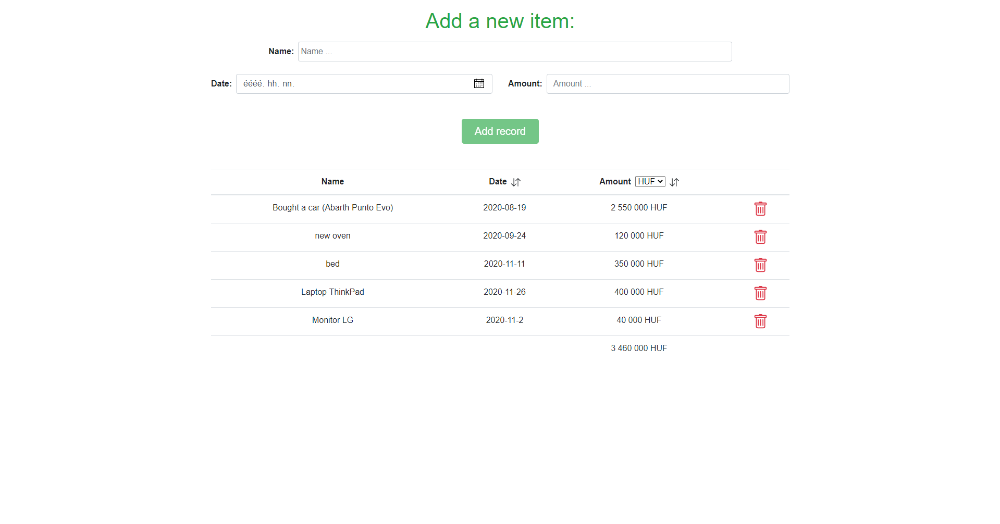
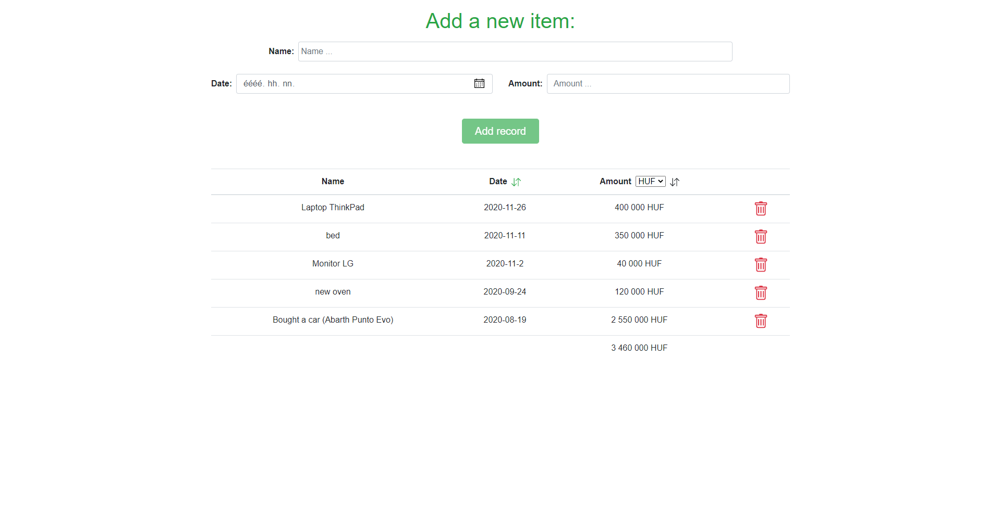
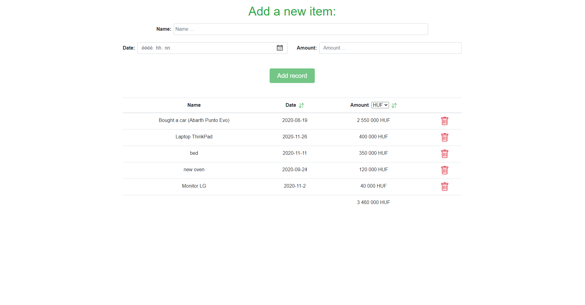

# vue-expense-tracker

You can:
  - Add the bought item name, date, amount
  - Sort by date and amount
  - Change currency
  - Delete and edit your added items
  
It will:
  - sum your total amount
